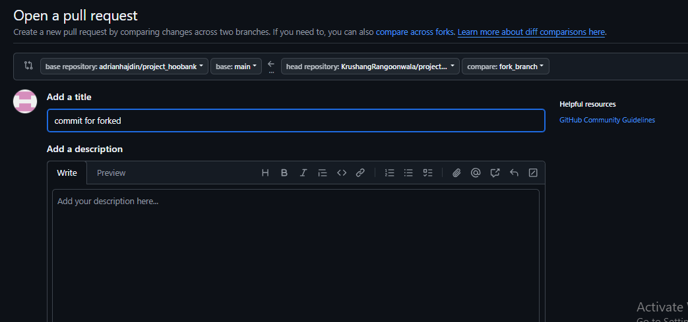

# Git and GitHub Commands Guide

## Initialize Git

```bash
git init  # Initializes Git in a folder
```

## Basic Git Workflow

Git operates in three stages: **file updated → staged → committed**

### File States and Commands

| File Operation | File State | Git Command |
| --- | --- | --- |
| File created | Untracked | `git add <file_path>` to start tracking |
| File updated | Modified | `git add <file_path>` to stage modifications |

### Commands for Tracking:

- `git add <file_path>`: Enables tracking for a specific file.

- `git add .`: Stages all modified or untracked files in the current folder.

  - *Tracking means Git monitors changes (lines added/removed) since the last staging operation.*

- `git diff <file_path>`: Shows changes (lines added/removed) for a file since the last staging operation.

- `git rm <file_path>`: Unstages a file, changing its status to Untracked.

- `git status`: Displays:

  - (a) Modified and staged files
  - (b) Modified but not staged files
  - (c) Staged files

*File status flow*:

1. File locally modified & not staged
2. File staged
3. File committed

---
- `git clean -f` Delete all untracked files
- `git clean -fd` Delete all untracked folders
<br>

### Committing Changes

- `git commit -m "commit message"`: Commits staged changes. A commit includes:
  1. Commit ID
  2. Author name & email
  3. Date & time
  4. Commit message
- `git commit -a -m "commit message"`: Stages and commits all modified files in one step.
- *Best practice*: Commit changes for a single functionality to make it easier to track changes. Avoid committing the entire codebase in one commit.

### Viewing Commit History

- `git log`: Shows all commits with Commit ID, author, date, and message.
- `git log --oneline`: Displays commits with short Commit ID and message.
- `git show <short_commit_id>`: Shows changes made in a specific commit.
- `git blame <file_path>`: Displays Commit ID, author, and date for each line in a file.

---
<br>

`git restore .` : *(Modified files are reverted to the latest committed version)*
- Restores modified files (discard modification of updated files)
- Keeps new/untracked files
- Keeps staged changes untouched

`git restore <file_name>` : 
Discard all modified files (restores them to original state)
<br>

## Resetting and Reverting Commits


- `git reset --hard`  : 
  - Resets your current branch to the last commit.
  - Discards:
    + All unstaged changes
    + All staged changes
    + Any new files added

- `git reset --hard <commit_id>`: Moves the HEAD to the specified commit, deleting all subsequent commits. *Warning*: These commits cannot be recovered.

  | Feature	| git reset --hard	| git restore . |
  | --- | --- | --- |
  | Discards modified files	| ✅	| ✅ |
  | Discards staged changes	| ✅	| ❌ |
  | Deletes new files	| ✅ (with git clean) |	❌ |
  | Safe to use	⚠️ (dangerous) |	✅ | (safe) |
<br>

- `git revert <commit_id>`: Reverts changes made in the specified commit (undoes additions, restores deletions). The reverted changes can be staged and committed as a new commit.

## Remote Repositories

- `git remote -v`: Lists remote repository links.

- `git remote add <server-name> <repository-link>`: Adds a remote repository.\
  Example:

  ```bash
  git remote add origin git@github.com:KrushangRangoonwala/repository-name
  ```

- `git remote remove origin`: Removes the remote repository link from the local machine.

## Pushing to Remote

- `git push`: Pushes the current branch to the remote repository.

- `git push origin <branch-name>`: Pushes specified branch on remote repository.
  Example:

  ```bash
  git push origin branch-2
  ```

- *For the first push*:

  ```bash
  git push -u origin main
  ```

## Branch Management
  | cmd | uses |
  | --- | --- |
  | `git branch`|  Lists all branches. | 
  | `git branch <new-branch-name>`|  Creates a new branch.| 
  | `git checkout <branch-name>`|  Switches to the specified branch.| 
  | `git checkout -b <new-branch-name>`|  Creates and switches to a new branch in one step.| 
  | `git branch -M <new-branch-name>`|  Renames the current branch.| 

- *Note*: To update branches on GitHub, push them using `git push`.

## Merging Branches

- **Using CLI**:

  ```bash
  git merge origin/<other-branch-name>
  ```

  Merges `other-branch-name` from the `origin` server into the current branch.

- **Using GitHub** : Create a pull request to merge branches. 

  To bring merged files to your local repository, use:

    ```bash
    git pull
    ```

### clone repo
```bash
git clone <HTTPS / SSH >
git clone https://github.com/username/repo-name.git
```

## Fork repository
**What is a Fork in GitHub?**

A fork is your own copy of someone else's repository under your GitHub account.

Think of it like :
*"Copy this repo to my GitHub so I can work on it independently."*

- After made changes in forked repo,
- Now, we want original repo owner accpect our changes
- For this, click on `Compare and Pull request` button in that repo on `github`
- Below screen will shown




## SSH key for github account

- When we push on a particular repo, 
- Github checks that, `Is local pc's SSH key match with the github account on which the repo exist`
- if **yes** then push is succeed


  | que | ans |
  | --- | --- |
  | Where to add SSH key? | ✅ Your GitHub Account |
  | Add per repository? | ❌ No |
  | Benefit | Access to all your GitHub repos without login prompts |

### Setting Up SSH Key for GitHub
1. **Check for existing SSH keys**:

   ```bash
   ls -al ~/.ssh
   ```

   Example output: `id_ed25519.pub`

2. **Generate a new SSH key**:

   ```bash
   ssh-keygen -t ed25519 -C "your_email@example.com"
   ```
    It will give two keys.
    - *Public* SSH key
    - *Private* SSH key

3. **Add SSH key to GitHub**:

- Copy the public key to clipboard:

  ```bash
  clip < ~/.ssh/id_ed25519.pub
  ```
-  Now, open GitHub → Your Account Settings → SSH and GPG Keys → New SSh key  →  paste public key

**Note : SSH key simply meant `That PC have authority to work with that github account`**